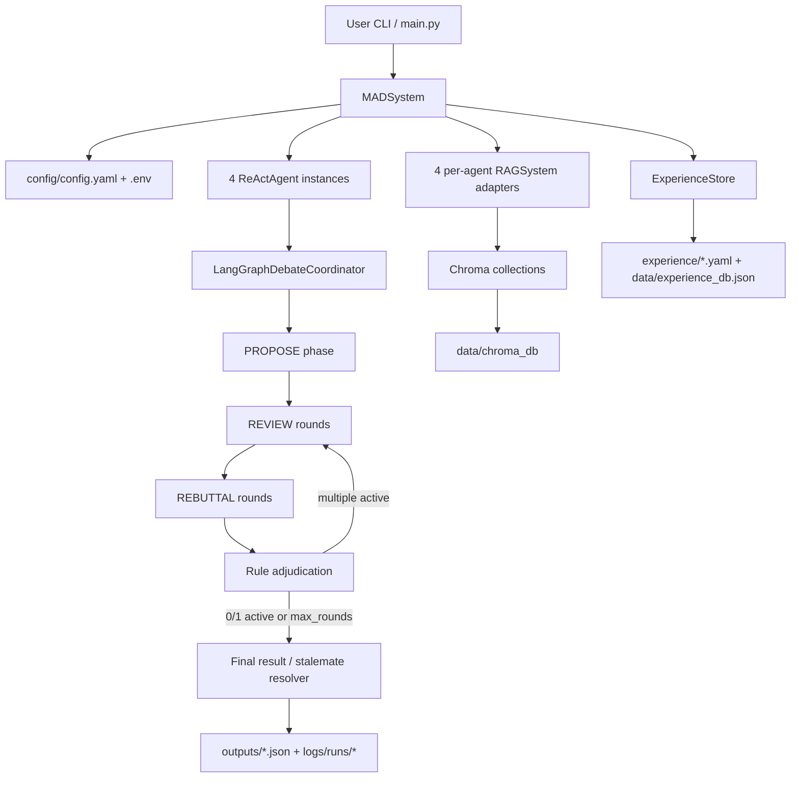
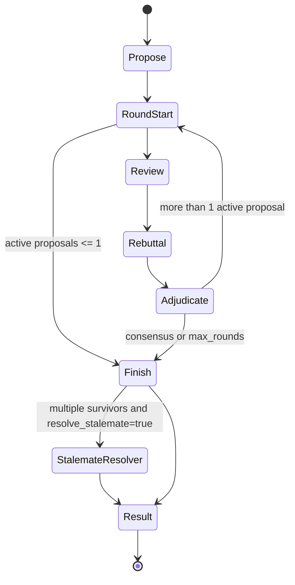

# 产品开发说明书：MAD 电催化多 Agent 辩论推荐系统

本文档面向后续开发、维护、测试和二次产品化，基于当前代码实现整理项目设计与架构。重点覆盖 `agents` 和 `debate` 两部分，并补充 RAG、经验库、配置、数据流、输出与测试约束。

## 1. 项目定位

本项目是一个面向电催化文献分析与性能预测的多 Agent 辩论系统。用户输入一个由 5 个金属元素组成的电极组成，以及可选的目标反应类型，系统通过多个大模型 Agent、文献 RAG、经验库和结构化辩论协议，输出目标反应下的产物和性能指标预测。

核心使用场景：

- 给定 5 个金属元素，预测其在某个电催化反应中的关键性能。
- 给定 5 个金属元素，自动对多个反应类型分别运行辩论，再按性能等级排序。
- 通过本地 Markdown 文献库提供可追溯证据，避免纯参数化猜测。
- 通过多模型互评、反驳和规则裁决，提高结果稳定性和可解释性。

当前默认并且唯一支持的辩论引擎是 `langgraph`，但该实现是项目内自研的 LangGraph-style 状态机，不依赖外部 `langgraph` 包。

## 2. 产品输入输出

### 2.1 输入

命令行入口为 `main.py`。

单反应辩论：

```bash
python main.py --components "Pt,Pd,Ru,Ir,Rh" --reaction-type OER
```

带相对百分比的电极组成：

```bash
python main.py --components "Ni(69.00%), Co(19.07%), Fe(11.48%), Cu(0.40%), Zn(0.05%)" --reaction-type OER
```

自动反应排序：

```bash
python main.py --components "Pt,Pd,Ru,Ir,Rh" --rank-reactions
```

输入约束：

- `components` 必须解析为恰好 5 个金属元素。
- 元素可以只写符号，也可以全部带百分比。
- 如果任何元素带百分比，则所有元素都必须带百分比。
- 百分比会被归一化为总和 100.00%。
- 如果用户未提供百分比，系统会根据元素列表生成确定性的伪随机相对百分比。
- 支持的反应类型由 `config/config.yaml` 的 `chemistry.reaction_types` 定义，当前包括 `CO2RR/EOR/HER/HOR/HZOR/O5H/OER/ORR/UOR`。

### 2.2 输出

单反应输出：

- 返回一个结果字典。
- 默认写入 `outputs/result_<timestamp>.json`。
- 同时在 `logs/runs/<run_id>/debates/` 下写入完整辩论 JSON 和 transcript JSONL。

反应排序输出：

- 写入 `outputs/rank_<timestamp>.json`。
- 包含每个反应的摘要、性能等级和 Top-K 排名。

关键输出字段：

- `consensus_reached`：是否达成共识。
- `final_products`：最终产物；非 CO2RR 通常为 `N/A`。
- `final_performance`：最终性能预测文本。
- `surviving_proposals`：仍存活的提案。
- `defeated_proposals`：因未有效回应审查而失败的提案。
- `withdrawn_proposals`：主动或自动退出的提案。
- `winner_proposal_id`：僵局打分解决时选出的获胜提案。
- `performance_evaluation`：可解析时给出的归一化指标与等级。

## 3. 总体架构

项目主链路可以理解为：



主要模块职责：

| 模块 | 文件 | 职责 |
|---|---|---|
| 系统入口 | `main.py` | 初始化配置、RAG、经验库、Agent、协调器；运行单反应辩论或反应排序 |
| Agent 工厂 | `agents/llm_agents.py` | 根据 provider 和配置创建 `ReActAgent` |
| Agent 配置 | `agents/agent_config.py` | 加载/读取 LLM、RAG、辩论、经验库等配置 |
| ReAct Agent | `agents/react_agent.py` | LangChain tool-calling ReAct 运行时，负责检索、分析、结论、轨迹记录 |
| ReAct 数据结构 | `agents/react_reasoning.py` | `ReActTrajectory`、`ReActStep`、`ToolCallRecord` |
| 辩论协调器 | `debate/langgraph_coordinator.py` | Propose/Review/Rebuttal/Adjudication 状态机 |
| 阶段提示词 | `prompts/debate_phase_prompts.py` | PROPOSE、REVIEW、REBUTTAL 阶段协议 |
| 统一提示词 | `prompts/system_prompts.py` | 领域约束、证据优先、输出格式约束 |
| RAG adapter | `database/rag_system.py` | 查询 embedding + Chroma 相似度检索 |
| Embedding | `database/embedder.py` | 按 agent 动态选择 OpenRouter/ZenMux/Voyage/Aliyun embedding |
| Chroma 封装 | `database/vector_store.py` | collection 创建、写入、查询、稳定 chunk id |
| 文献处理 | `database/text_processor.py` | Markdown 文献加载、DOI 提取、分块 |
| 经验库 | `experience/experience_store.py` | YAML 经验包 + JSON 动态经验检索 |
| 日志 | `utils/logger.py` | run 级日志、events JSONL、debate artifacts |
| 性能评分 | `utils/performance_grading.py` | 根据反应类型解析指标并映射等级 |

## 4. 运行生命周期

### 4.1 系统初始化

`MADSystem.initialize()` 的顺序：

1. `_init_rag_systems()`
2. `_init_experience_store()`
3. `_init_agents()`
4. `_init_debate_coordinators()`

设计要点：

- RAG 是必需组件，每个 agent 绑定一个独立 collection。
- 经验库在 Agent 创建前初始化，用于 `search_experience` 工具。
- 所有 Agent 都是 `ReActAgent`，区别主要来自 LLM 配置、embedding 配置和绑定的 RAG collection。
- 协调器只初始化 `LangGraphDebateCoordinator`。

### 4.2 单次辩论流程

`MADSystem.run_debate()` 的核心步骤：

1. 解析 `components`，拆成 `elements` 和可选 `percents`。
2. 构造稳定的 `electrode_composition` 字符串。
3. 校验必须为 5 个非重复元素。
4. 规范化 `reaction_type`。
5. 使用 `build_initial_debate_prompt()` 构建初始提案 prompt。
6. 调用 `LangGraphDebateCoordinator.start_debate()`。
7. 将 `GraphDebateResult` 转成字典并补充 `engine`、`electrode_composition`。
8. 尝试用 `utils.performance_grading.evaluate_claim()` 解析最终性能并评级。
9. 写入结果文件和日志。

### 4.3 反应排序流程

`MADSystem.run_rank_reactions()` 会对多个反应类型逐一运行辩论，然后按等级排序。

排序策略在 `utils/reaction_ranking.py`：

1. 主排序：`Outstanding > Good > Fair > Poor > Terrible`。
2. 同等级 tie-break：
   - lower-is-better 反应：指标越小越好。
   - higher-is-better 反应：指标越大越好。

当 `max_parallel_reactions > 1` 时，系统会为每个反应构造隔离的 coordinator、agents 和 RAG adapters，减少共享状态和线程安全风险。

## 5. Agent 设计详解

### 5.1 Agent 列表

默认 4 个 Agent：

| Agent ID | 名称 | 默认聊天模型 | 默认 embedding |
|---|---|---|---|
| `agent1` | GPT Researcher | `openai/gpt-5.2` | `openai/text-embedding-3-large` |
| `agent2` | DeepSeek Researcher | `deepseek/deepseek-v3.2` | `voyage-3-large` |
| `agent3` | Gemini Researcher | `google/gemini-3-pro-preview` | `google/gemini-embedding-001` |
| `agent4` | Qwen Researcher | `qwen/qwen3-max-thinking` | `text-embedding-v4` |

这些配置在 `config/config.yaml` 的 `llm.agent1` 到 `llm.agent4` 下维护。

### 5.2 Agent 创建

`agents/llm_agents.py:create_agent()` 做三件事：

- 校验 provider 是否支持。
- 补齐 provider 默认 OpenAI-compatible `base_url`。
- 创建 `ReActAgent`，注入：
  - `agent_id`
  - `name`
  - `model_config`
  - `rag_system`
  - `experience_store`
  - `UNIFIED_SYSTEM_PROMPT`

当前所有 provider 最终都通过 LangChain `ChatOpenAI` 或兼容接口调用。

### 5.3 ReAct 运行时

`ReActAgent.generate_response_with_react()` 是 Agent 的核心。

每一个 ReAct step 拆成两个 LLM 调用：

1. THOUGHT 调用：
   - 不绑定工具。
   - 要求输出 1-3 句简短思考。
   - 清理模型偶发输出的 tool-call markup。

2. ACTION 调用：
   - 绑定工具。
   - 要求必须发出一个或多个 tool calls。
   - 工具执行后形成 Observation。

每一步会记录为 `ReActStep`：

- `step_number`
- `thought`
- `action`
- `action_input`
- `tool_calls`
- `observation`
- `observation_data`
- `timestamp`

完整调用记录为 `ReActTrajectory`，后续 review 可以按 `target_step_number` 精确攻击某个步骤。

### 5.4 Agent 工具

`ReActAgent._build_tools()` 注册 5 个工具：

| 工具 | 作用 |
|---|---|
| `search_literature` | 查询本地 Chroma 文献库，返回 chunks、分数、metadata、source_id |
| `fetch_literature_chunk` | 根据 canonical source_id 精确拉取一个 chunk |
| `search_experience` | 查询经验库和 guideline |
| `analyze` | 记录中间分析，不做外部查询 |
| `conclude` | 提交最终答案 |

### 5.5 工具使用约束

ACTION 阶段有强约束：

- 单个 ACTION step 中不能混用检索类工具和分析/结论类工具。
- 检索类工具包括：
  - `search_literature`
  - `search_experience`
  - `fetch_literature_chunk`
- 分析/结论类工具包括：
  - `analyze`
  - `conclude`

如果模型混用，系统会拒绝分析/结论调用，并返回 `mixed_search_and_analysis` 观察，让模型下一步修正。

每个阶段还会从 system prompt 中解析 retrieval budget，例如：

- PROPOSE：最多 2 个 ACTION step 可检索。
- REVIEW：最多 1 个 ACTION step 可检索。
- REBUTTAL：最多 1 个 ACTION step 可检索。

临近 step budget 末尾时，`deadline_mode` 会禁止继续检索，强制进入分析或结论。

### 5.6 文献检索逻辑

`_tool_search_literature()` 不只是简单 top-k：

1. 根据当前任务上下文推断目标元素和反应类型。
2. 如果启用 `rag_filter_by_reaction_type`，对 Chroma 查询加 `where={"reaction_type": target_rt}`。
3. overfetch，多取若干倍结果。
4. 硬过滤 reaction_type metadata 不匹配的结果。
5. 过滤低信息 chunk：
   - 空文本
   - 纯关键词
   - 纯标题
   - 过短且无数字锚点的文本
6. 生成 canonical source_id：
   - `rag:chroma/<collection>/doi:<doc_id>#chunk:<chunk_index>`
7. 提取 chunk 中出现的元素符号，计算：
   - `element_match_count`
   - `element_missing`
   - `forbidden_elements`
   - `reaction_match`
8. 重新排序：
   - 反应类型匹配优先
   - 目标元素匹配越多越优先
   - forbidden catalyst metals 越少越优先
   - 原始相似度分数作为后续依据

该设计是为了减少 HEA 查询中常见的热门体系漂移，例如误召回 CoCrFeMnNi 而不是用户给定的五元体系。

### 5.7 经验检索逻辑

`search_experience` 查询 `ExperienceStore`：

- 组件相似案例按 Jaccard overlap 排序。
- 全局 guideline 可按关键词与当前 query 匹配。
- 配置 `always_include_guidelines=true` 时，总会优先混入若干 guideline。
- 对不同反应类型附加 query hints，例如：
  - OER/HER/UOR/HZOR：`overpotential 10 mA/cm^2 potential`
  - ORR：`half-wave potential e1/2`
  - HOR：`exchange current density j0`
  - CO2RR：`FE partial current density`

经验结果只作为启发式指导；若与文献冲突，prompt 要求优先文献。

### 5.8 结论守卫与修复

Agent 层实现了多种兜底，保证协调器收到可解析输出。

关键机制：

- 如果 ACTION 没有 tool calls，会记录 `no_tool_call` step，并向模型反馈必须使用工具。
- 如果 STRICT JSON 阶段直接在普通 content 中输出 JSON，系统会尝试接受为 synthetic conclude。
- 如果 STRICT JSON 无效，会依次尝试：
  1. 提取首个 JSON object。
  2. 修复字符串中的未转义换行、控制字符。
  3. 按阶段 schema salvage。
  4. 最后生成最小 schema-compatible JSON。
- 如果达到最大 step 仍无结论，会 forced conclude。
- PROPOSE 中会校验结论是否显式包含所有任务金属元素。
- PROPOSE 的性能指标行会尽量要求单点估计和 confidence。

### 5.9 请求限流

所有 LLM 和 embedding 外部请求通过 `utils.request_limiter.get_global_limiter()` 共享一个进程级 `BoundedSemaphore`，默认最大并发为 6。目的：

- 降低并行反应和多 Agent 检索时的 API burst。
- 减少 429、空 embedding、连接不稳定等问题。

## 6. Debate 协调器详解

### 6.1 核心状态结构

`debate/langgraph_coordinator.py` 定义了两类结构：

Pydantic 输出 schema：

- `ProposalOutput`
- `ReviewOutput`
- `RebuttalOutput`
- `EvidenceItem`

运行时状态 dataclass：

- `ProposalState`
- `DebateReview`
- `DebateRebuttal`
- `GraphDebateResult`

`ProposalState` 是单个提案的长期状态：

- `proposal_id`
- `agent_name`
- `status`: `active | withdrawn | defeated`
- `no_response_streak`
- `call_error_streak`
- `claim`
- `propose_response`
- `propose_trajectory`
- `received_reviews`
- `sent_reviews`
- `sent_rebuttals`

### 6.2 状态机

协调器的主流程在 `start_debate()`：



### 6.3 PROPOSE 阶段

`_run_propose_phase()`：

- 为每个 agent 初始化一个 `ProposalState`。
- 用 `ThreadPoolExecutor` 并行调用所有 agent。
- 每个 agent 使用 `DEBATE_PROPOSE_SYSTEM_PROMPT`。
- 每个调用传入：
  - 当前 components
  - propose system prompt
  - `propose_max_react_steps`
  - `call_timeout_seconds`
- 整个阶段受 `propose_timeout_seconds` 限制。
- 超时的 proposal 直接标记 `withdrawn`。

PROPOSE 输出要求为 STRICT JSON：

```json
{
  "reaction_type": "OER",
  "electrode_composition": "Ni(69.00%), Co(19.07%), Fe(11.48%), Cu(0.40%), Zn(0.05%)",
  "catalyst_metal_elements": ["Ni", "Co", "Fe", "Cu", "Zn"],
  "products": "N/A",
  "performance_metrics": "310 mV overpotential at 10 mA/cm^2",
  "confidence": "low | medium-low | medium | medium-high | high",
  "evidence": [
    {"source_id": "rag:chroma/.../doi:10.xxxx#chunk:7", "quote": "optional"}
  ],
  "rationale": "..."
}
```

协调器不会因为轻微 schema 问题直接丢弃提案，而是通过 `_coerce_proposal_output()` 补齐：

- 反应类型优先使用 coordinator 已知的 `reaction_type`。
- 元素列表优先使用 coordinator 已知的 5 个元素。
- 电极组成从模型输出、初始 prompt 或元素列表中补齐。
- 非 CO2RR 的 products 稳定为 `N/A`。
- evidence 缺失时，从该 agent 本次 trajectory 检索到的 source_id 中补齐，否则使用 `llm`。

随后 `_render_proposal_claim()` 将结构化提案渲染为统一文本 claim，供 review/rebuttal 使用。

### 6.4 机制调整约束

当提案引用了非 `llm` 的可验证文献 source_id 时，`_enforce_proposal_mechanism_sections()` 要求 rationale 包含：

- `Mismatch:`
- `Mechanism:`
- `Adjustment:`

如果缺失：

- 自动把 confidence 降为 `low`。
- 在 rationale 附加 AUTO-NOTE。

这对应领域提示词里的原则：引用不同组成、比例或条件的文献时，只能作为类比，必须说明差异、机理和数值调整依据。

### 6.5 REVIEW 阶段

`_run_review_round()`：

- 只让 active proposal 参与。
- `_assign_review_targets()` 使用轮转方式分配 review 目标。
- 每个 reviewer 每轮默认只 review 一个 target。
- 每个 target 至少被一个 reviewer 覆盖。
- REVIEW 阶段并行执行，受 `review_timeout_seconds` 限制。

REVIEW prompt 包含：

- target proposal id。
- target claim。
- target trajectory 的前若干 step。
- 每个 step 的 `step_number`、`action` 和 observation snippet。

输出 schema：

```json
{
  "reviews": [
    {
      "target_proposal_id": "agent2",
      "target_step_number": 2,
      "flaw_type": "missing_evidence | wrong_inference | contradiction | irrelevant_evidence | tool_misuse | other",
      "critique": "...",
      "evidence": [
        {"source_id": "rag:chroma/.../doi:10.xxxx#chunk:3", "quote": "optional"}
      ]
    }
  ]
}
```

Review 可以返回空列表，表示没有有价值的质疑。

### 6.6 Review 校验

`_validate_review_item()` 的有效性规则：

- target proposal 必须存在且仍为 active。
- `target_step_number` 必须存在于 target 的 propose trajectory。
- evidence 可选。
- 如果提供 evidence：
  - `source_id="llm"` 表示参数化知识，允许。
  - 非 `llm` source_id 必须是 canonical Chroma source_id。
  - 该 source_id 必须出现在 reviewer 本次 REVIEW 调用的检索 trajectory 中。

这种设计防止 agent 在 review 时伪造 citation 或引用其他阶段/其他 agent 检索到的证据。

### 6.7 REBUTTAL 阶段

`_run_rebuttal_round()`：

- 只对本轮 valid reviews 的 target proposal 发起 rebuttal。
- 没有 valid reviews 的 proposal 本轮无需回应。
- 每个 active proposal 对指向自己的所有 valid review 一次性回应。
- 阶段并行执行，受 `rebuttal_timeout_seconds` 限制。

输出 schema：

```json
{
  "rebuttals": [
    {
      "target_review_id": "rev_r1_agent2_0",
      "response_mode": "defend | revise | withdraw | no_response",
      "response": "...",
      "evidence": [
        {"source_id": "rag:chroma/.../doi:10.xxxx#chunk:7", "quote": "optional"}
      ]
    }
  ],
  "revised_claim": "(optional; required if revise)"
}
```

`response_mode` 语义：

- `defend`：保留原 claim，用回应反驳 critique。
- `revise`：承认部分问题并更新 `revised_claim`。
- `withdraw`：主动退出。
- `no_response`：未有效回应。

### 6.8 Rebuttal 校验与 claim 更新

`_validate_rebuttal_item()` 的有效性规则：

- `target_review_id` 必须属于本 proposal 当前需要回应的 valid review。
- `response_mode` 必须属于允许集合。
- `defend` 和 `revise` 必须有非空 response。
- evidence 可选；若提供，必须能在本次 rebuttal trajectory 中验证，或为 `llm`。

当存在 `revised_claim`：

- 先把 literal `\n` 规范为真实换行。
- `_soft_enforce_revised_claim_metrics()` 检查是否保留定量 `Performance Metrics:`。
- 如果 revised claim 缺失或用 `N/A/unknown/TBD` 回避性能指标：
  - 优先从旧 claim 恢复性能指标。
  - confidence 设置为 low。
  - 附加 AUTO-NOTE。
- 如果 rebuttal 有可验证 evidence，但 revised claim 未包含 source_id，会自动追加 `Evidence:` 行。
- proposal 的 `claim` 会被替换为 revised claim。

### 6.9 规则裁决

`_rule_adjudicate()` 是非 LLM 的确定性裁决器。

裁决规则：

- valid reviews 会影响共识和惩罚。
- review 即使只基于 `llm` 参数化知识，也可以是 valid。
- 如果 active proposals 之间本轮没有任何 valid review：
  - 只有当 review 调用都干净完成时才判定 consensus。
  - 如果 review 阶段有 timeout、异常或 invalid JSON，不判定共识，避免“错误沉默”导致假共识。
- 对每个被 valid reviews 攻击的 proposal：
  - 如果对应 review 没有 valid rebuttal，记为 unresolved。
  - 如果所有 valid reviews 都被 `defend/revise/withdraw` 有效回应，则清零 `no_response_streak`。
  - 如果存在 unresolved，则 `no_response_streak += 1`。
  - 当 streak 达到 `no_response_threshold`，proposal 标记为 `defeated`。
- 若剩余 active proposal 数量小于等于 1，则 consensus。

### 6.10 自动退出策略

`_apply_auto_withdraw_policy()` 用于处理持续调用失败的 agent。

默认配置：

- `auto_withdraw_on_call_errors: true`
- `auto_withdraw_call_error_threshold: 2`
- `auto_withdraw_call_error_types: ["timeout", "invalid_json"]`
- `auto_withdraw_status: "withdrawn"`

当同一 proposal 连续在 review/rebuttal 中出现配置内错误达到阈值，会被自动标记为 withdrawn，并写入 `auto_withdraw` history event。

### 6.11 僵局解决

如果到达 `max_rounds` 后仍有多个 active proposals，且 `resolve_stalemate=true`，系统会调用 `_resolve_stalemate_score()`。

该过程不再调用 LLM，完全确定性。

打分偏好顺序：

1. 电极组成是否严格匹配预期组成。
2. 反应类型是否匹配目标反应。
3. 是否有 performance metric。
4. metric 是否为单点估计。
5. 可验证 source_id 数量。
6. self-reported confidence。
7. proposal_id 作为最终稳定 tie-break。

如果 metric 是范围或带不确定度，会按 `stalemate_range_strategy` 转成单点：

- `conservative`：
  - lower-is-better 反应取更差的较大值。
  - higher-is-better 反应取更差的较小值。
- `mean`：取均值。

最终输出会强制使用预期电极组成，必要时附加 AUTO-NOTE。

## 7. Prompt 设计

### 7.1 统一领域约束

`prompts/system_prompts.py` 中的 `UNIFIED_SYSTEM_PROMPT` 包含：

- 角色：高级电化学研究员。
- 目标：给定电极组成和目标反应预测性能。
- 元素忠实性硬约束：
  - 只能使用用户提供的金属元素。
  - 不得替换或引入新催化金属。
  - 若百分比已提供，不得更改。
- 反应类型忠实性硬约束：
  - 文献证据和数值指标必须对应目标反应。
  - 其他反应证据视为不相关。
- 反应类型对应指标：
  - HER/OER：10 mA/cm^2 下过电位。
  - ORR：半波电位 E1/2。
  - HOR：交换电流密度 j0。
  - UOR/HZOR：10 mA/cm^2 下电位或过电位。
  - EOR：质量活性。
  - O5H：法拉第效率。
  - CO2RR：最高 FE 产物、FE 值和 partial current density。
- 证据优先：
  - 先 `search_experience`。
  - 后 `search_literature`。
  - citation 必须使用 canonical source_id。

### 7.2 阶段提示词

`prompts/debate_phase_prompts.py` 中有三个阶段 prompt：

- `DEBATE_PROPOSE_SYSTEM_PROMPT`
- `DEBATE_REVIEW_SYSTEM_PROMPT`
- `DEBATE_REBUTTAL_SYSTEM_PROMPT`

PROPOSE 强调：

- 最多 5 个 ReAct steps。
- 第一轮 ACTION 应并行发出至少 3 个 retrieval tool calls。
- 最多 2 个 ACTION steps 可检索。
- 结论必须 STRICT JSON。
- 性能指标必须是单点估计。

REVIEW 强调：

- 最多 3 个 ReAct steps。
- 最多 1 个检索 ACTION step。
- 必须攻击目标 trajectory 中存在的具体 step。
- evidence 可选，但若提供必须可验证。

REBUTTAL 强调：

- 最多 4 个 ReAct steps。
- 最多 1 个检索 ACTION step。
- 必须逐条回应 review_id。
- 可以 defend/revise/withdraw/no_response。
- revise 时必须保留单点 Performance Metrics 和 Confidence。

## 8. RAG 与数据层

### 8.1 文献目录

所有文献方向由 `database/literature_types.py` 中唯一的
`LITERATURE_TYPE_CONFIGS` 维护。每个 Literature Type 同时配置 Markdown 目录和
CSV 元数据路径，例如：

```text
data/raw/OER/*.md                  metadata/OER.csv
data/raw/conductivity/*.md         metadata/Conductivity.csv
```

CSV 固定表头为 `file_name,doi,abstract`。`file_name` 是本地 PDF 文件名，
Markdown 与 PDF 同名但扩展名为 `.md`；匹配时去除扩展名并忽略大小写。

### 8.2 文献加载与分块

`TextProcessor` 负责：

- 通过 `load_literature_type_documents()` 统一加载所有 Literature Type。
- 从 CSV DOI、Markdown 正文 DOI 或稳定的 `no-doi` fallback 生成 `doc_id`。
- 校验 CSV 的 `abstract` 字段，但不把摘要复制到 Document 或 chunk metadata。
- 给每个文档写入 metadata：
  - `reaction_type`
  - `doc_id`
- 使用 LlamaIndex 的两级分块：
  - `MarkdownNodeParser`
  - `SentenceSplitter`
- chunk metadata 包含：
  - `chunk_id`：初始 numeric index。
  - `total_chunks`。

### 8.3 向量库构建

推荐脚本是 `build_vector_db_batch.py`。

核心设计：

- 文档只加载和分块一次。
- 为每个 agent 分别计算 embedding。
- 每个 agent 写入独立 Chroma collection。
- collection 命名为 `<base_collection_name>_<agent_name>`。
- 当前配置中 base collection 是 `literature_02`，因此默认 collection 包括：
  - `literature_02_agent1`
  - `literature_02_agent2`
  - `literature_02_agent3`
  - `literature_02_agent4`

稳定 chunk id 规则：

- 如果有 DOI 且有 chunk index：
  - Chroma id 为 `<doi>#chunk:<idx>`。
- 否则：
  - 使用 chunk 文本 SHA256：`hash_<digest>`。
- metadata 中保留：
  - `chunk_id`：Chroma id 字符串。
  - `chunk_index`：原 numeric chunk index。

### 8.4 RAG 查询

运行时 `RAGSystem.retrieve()`：

1. 用注入的 `MultiModelEmbedder` 对 query 做 embedding。
2. 调用 `VectorStore.similarity_search(query_embedding=...)`。
3. 将 Chroma distance 转为近似 similarity score：`1 - distance`。
4. 应用可选 `similarity_threshold`。
5. 返回 `[{text, score, metadata}, ...]`。

`ReActAgent.search_literature` 会在此基础上补充 source_id 和任务相关性 rerank。

### 8.5 Source ID 规范

项目使用 canonical source_id 表示一个具体文献 chunk：

```text
rag:chroma/<collection>/doi:<doc_id>#chunk:<chunk_id>
```

相关工具在 `utils/source_id.py`：

- `build_chroma_source_id()`
- `parse_chroma_source_id()`
- `is_valid_chroma_source_id()`
- `normalize_chroma_source_id()`

证据验证原则：

- 非 `llm` source_id 必须符合 canonical 格式。
- Review/Rebuttal 中引用的 source_id 必须来自同一次 agent 调用实际检索到的结果。
- `fetch_literature_chunk` 可用于验证另一个 agent 的 citation。

## 9. 经验库设计

`ExperienceStore` 支持两类经验：

1. 动态 JSON 经验：
   - 默认路径 `data/experience_db.json`。
   - 可追加、删除、导入导出。
   - 当前主流程中的 `_extract_and_save_experience()` 是预留接口，实际禁用。

2. YAML pack：
   - 默认路径 `experience/`。
   - 只读。
   - 支持显式 `experiences` 列表。
   - 支持 Hydra-style `agent.instructions` 中的 `[G0]. ...` guideline 提取。

经验查询：

- case experience 按组件 Jaccard 相似度匹配。
- guideline 是全局经验，不依赖组件。
- keyword 模式下，guideline 会根据 query tokens 与 guideline tokens 的 IDF overlap 排序。
- 可通过配置控制：
  - `guideline_top_k`
  - `always_include_guidelines`
  - `guideline_search_mode`
  - `relevance_threshold`

## 10. 配置说明

主配置文件是 `config/config.yaml`。

### 10.1 LLM 配置

`llm.agentN` 包含：

- `provider`
- `model`
- `api_key`
- `base_url`
- `temperature`
- `max_tokens`
- `embedding_model`
- `embedding_provider`
- provider 特定 embedding key 或 URL

环境变量通过 `${VAR_NAME}` 引用，由 `utils.helpers.load_config()` 递归替换。

### 10.2 Vector Store 配置

```yaml
vector_store:
  type: "chroma"
  persist_directory: "./data/chroma_db"
  collection_name: "literature_02"
  distance_metric: "cosine"
```

运行时会在 base collection 后追加 `_agent1` 到 `_agent4`。

### 10.3 RAG 配置

```yaml
rag:
  chunk_size: 256
  chunk_overlap: 50
  top_k: 5
  similarity_threshold: 0.8
```

注意：

- `chunk_size` 和 `chunk_overlap` 主要影响构建索引。
- `top_k` 和 `similarity_threshold` 影响运行时检索。

### 10.4 Debate 配置

关键字段：

- `max_rounds`
- `propose_timeout`
- `review_timeout`
- `rebuttal_timeout`
- `timeout`
- `resolve_stalemate`
- `stalemate_method`
- `stalemate_percent_tolerance`
- `stalemate_range_strategy`
- `auto_withdraw_on_call_errors`
- `auto_withdraw_call_error_threshold`
- `auto_withdraw_call_error_types`
- `propose_max_react_steps`
- `review_max_react_steps`
- `rebuttal_max_react_steps`
- `no_response_threshold`
- `max_reviews_per_target`

### 10.5 Logging 配置

默认输出：

```text
logs/system.log
logs/runs/<run_id>/run.log
logs/runs/<run_id>/events.jsonl
logs/runs/<run_id>/debate.log
logs/runs/<run_id>/db.log
logs/runs/<run_id>/debates/debate_<debate_id>.json
logs/runs/<run_id>/debates/debate_<debate_id>_transcript.jsonl
```

## 11. 性能评分与反应排序

`utils/performance_grading.py` 负责将最终 claim 中的 `Performance Metrics:` 解析成统一指标。

不同反应类型的优化方向：

- lower-is-better：
  - HER
  - OER
  - UOR
  - HZOR
- higher-is-better：
  - ORR
  - HOR
  - EOR
  - O5H
  - CO2RR

等级：

- `Outstanding`
- `Good`
- `Fair`
- `Poor`
- `Terrible`

如果无法解析目标反应或指标单位，`evaluate_claim()` 返回 `None`，排序时该项会缺少 grade/metric。

## 12. 日志与可观测性

日志系统目标：

- 单进程只配置一次 logging。
- 每次运行有独立 run_id。
- 同时保留 human-readable log 和 JSONL structured events。
- debate 过程额外落完整 artifacts。

重要事件包括：

- `agent.react.start`
- `agent.react.end`
- `agent.react.action`
- `agent.react.observation`
- `agent.react.strict_json_repair`
- `agent.react.strict_json_salvage`
- `langgraph.debate.start`
- `langgraph.propose.call`
- `langgraph.review.call`
- `langgraph.rebuttal.call`
- `langgraph.round.end`
- `langgraph.auto_withdraw`
- `langgraph.debate.end`
- `langgraph.artifacts.written`

调试时优先查看：

1. `logs/runs/<run_id>/events.jsonl`
2. `logs/runs/<run_id>/debates/*_transcript.jsonl`
3. `outputs/result_*.json`

## 13. 测试设计

测试目录为 `test/`，可用：

```bash
python -m unittest discover -s test -p "test_*.py"
```

测试覆盖重点：

- ReAct 工具调用解析。
- STRICT JSON 修复、salvage、fallback。
- PROPOSE 输出 contract。
- PROPOSE 性能指标行规则。
- 结论元素守卫。
- RAG 反应类型过滤和 junk chunk 过滤。
- source_id 规范化。
- evidence collection。
- review/rebuttal 规则裁决。
- auto-withdraw。
- timeout/deadline mode。
- stalemate resolver。
- experience YAML pack。
- vector store 稳定 id。
- performance grading。
- reaction ranking。

注意：

- 部分测试是纯单元测试，不需要外部 API。
- `test_debate_langgraph_rag_chroma.py` 和 `test_rag_reasoning.py` 属于更接近 E2E 的脚本，会依赖 `.env` API key 和已有 Chroma collection。

## 14. 关键设计取舍

### 14.1 为什么每个 Agent 有独立 Chroma collection

不同 Agent 使用不同 embedding 模型。为了保证查询向量与库向量同源，项目为每个 Agent 构建独立 collection：

- agent1 使用配置的 ZenMux/OpenAI-compatible embedding。
- agent2 使用 Voyage embedding。
- agent3 使用配置的 ZenMux/OpenAI-compatible embedding。
- agent4 使用 Aliyun/Qwen embedding。

运行时 RAG adapter 根据 agent_id 选择对应 embedding profile 和 collection。

### 14.2 为什么 Agent 是 memoryless

`ReActAgent` 每次调用只接收当前 query、system prompt 和 components，不保存跨阶段对话记忆。辩论上下文由 `LangGraphDebateCoordinator` 显式存储并在 prompt 中注入。

好处：

- 阶段状态可审计。
- review 可以精确引用 propose trajectory。
- 并行调用更安全。
- 失败恢复更清晰。

### 14.3 为什么 evidence 可选但若提供必须可验证

Review/Rebuttal 阶段允许参数化科学判断，否则当检索预算不足或文献库缺少精确匹配时，系统容易错误达成共识。

但只要模型声称有文献 evidence，就必须满足：

- canonical source_id。
- 来自本次调用实际检索结果。

这平衡了科学 critique 的开放性和 citation 的可追溯性。

### 14.4 为什么存在 deterministic repair/fallback

不同 OpenAI-compatible provider 的 tool-calling 行为不完全一致，常见问题包括：

- ACTION 阶段返回普通文本而非 tool calls。
- STRICT JSON 包含 markdown fence。
- JSON 字符串内有未转义换行。
- 以 legacy `function_call` 形式返回。
- Gemini 路由在 system role 下返回空 thought。

项目通过本地修复和最小 schema fallback 保证 debate 状态机不会因为格式问题崩溃。

## 15. 开发扩展指南

### 15.1 新增 Agent

需要修改：

1. `config/config.yaml` 增加 `llm.agentX`。
2. `main.py` 的 `_init_rag_systems()` agent list。
3. `main.py` 的 `_init_agents()` agent_specs。
4. `AgentConfig.create_all_agents()` 中的 agent_configs。
5. `build_vector_db_batch.py` 的默认 agent order 或 CLI 参数。
6. 确保为该 agent 构建 `<collection_name>_agentX`。

注意：

- embedding provider 与 collection 必须一致。
- embedding 并发、provider 配额、失败语义和 Chroma 写入流水线的目标规格见
  `docs/superpowers/specs/2026-07-15-embedding-concurrency-design.md`。

### 15.2 新增反应类型

需要修改：

1. `config/config.yaml` 的 `chemistry.reaction_types`。
2. `prompts/system_prompts.py` 的 required metric 规则。
3. `database/literature_types.py` 的 `LITERATURE_TYPE_CONFIGS`。
4. `utils/reaction_types.py` 的规范化映射。
5. `utils/performance_grading.py` 的 metric parser、方向、等级阈值。
6. 相关测试。

若新反应需要 products 字段，也要同步修改 prompt 和 final field 解析逻辑。

### 15.3 新增工具

需要修改：

1. `agents/react_reasoning.py` 的 `ActionType`。
2. `ReActAgent._build_tools()` 注册 `StructuredTool`。
3. `ReActAgent._get_action_phase_instruction()` 说明工具使用时机。
4. 如果是检索类工具，加入 search_tools 集合。
5. 如果会产生 evidence，更新 `_collect_retrieved_source_ids_from_trajectory()` 和 `_extract_sources()`。
6. 补测试覆盖 tool-call parsing 与 trajectory serialization。

### 15.4 修改 debate 协议

修改前需要明确：

- 是否影响 Pydantic schema。
- 是否影响 prompt STRICT JSON schema。
- 是否影响 `_parse_json_output()` 和 validation。
- 是否影响 `debate_history` 结构。
- 是否影响 `GraphDebateResult.to_dict()`。
- 是否影响现有 tests 对 consensus、defeat、stalemate 的预期。

建议优先新增字段并保持兼容，而不是重命名现有字段。

## 16. 常见故障排查

### 16.1 初始化失败：API key 缺失

检查 `.env`：

```text
OPENAI_API_KEY=...
DEEPSEEK_API_KEY=...
GOOGLE_API_KEY=...
QWEN_API_KEY=...
VOYAGE_API_KEY=...
```

注意 agent4 的聊天和 embedding 可能使用不同 key。

### 16.2 RAG 无结果

检查：

- `data/chroma_db` 是否存在。
- collection 名是否与 `config.vector_store.collection_name` 和 agent 后缀一致。
- 是否执行过：

```bash
python build_vector_db_batch.py --agents agent1,agent2,agent3,agent4 --clear
```

- 文献 metadata 中 `reaction_type` 是否与目标反应一致。
- `similarity_threshold` 是否过高。

### 16.3 Review 没有产生共识但也没有有效 critique

查看 `review_call` event：

- `parsed_ok`
- `schema_ok`
- `error`
- `raw_output`
- `trajectory`

如果存在 timeout 或 invalid_json，协调器会避免把“无有效 review”误判为 consensus。

### 16.4 多个 proposal 一直存活

检查：

- `max_rounds`
- `resolve_stalemate`
- `stalemate_method`
- surviving proposals 的 claim 是否缺少 composition、reaction type 或 metric。

### 16.5 最终 claim Evidence 是 `llm`

可能原因：

- Agent 没有检索到文献。
- 检索到但 final answer 没有引用 source_id。
- source_id 格式不合法。
- citation 不在本次 trajectory 中，验证失败。
- stalemate resolver 选中的 claim 没有可验证 source_id。

## 17. 当前代码边界与注意事项

- 项目有部分中文注释在终端输出中显示为乱码，但核心逻辑不受影响。
- `LangGraphDebateCoordinator` 是自研状态机，不是外部 LangGraph。
- `ExperienceStore` 支持动态写入，但主流程的经验提取保存当前是禁用预留。
- PROPOSE 当前使用 STRICT JSON，但 Agent 层仍保留非 STRICT JSON 的 contract rewrite 兼容逻辑。
- `setup_logging()` 一进程只配置一次；测试中如果多次初始化系统，日志 run_id 可能不会重新配置。
- 并行反应会构建隔离 coordinator，但仍共享进程级 request limiter。
- Chroma persistent backend 写入并发通过 lock 串行化，但运行时读取仍要注意跨线程对象共享，因此并行反应会新建 RAG adapter。

